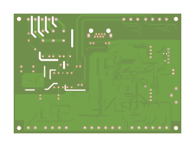

# Library Documentation

## Overview
This library is a comprehensive solution for working with Gerber files and layers in PCB design. Currently, it supports 274-x. It provides a set of classes to manage various types of PCB layers, including copper layers, solder masks, silkscreen, and substrate. These layers are processed with the help of parsers and factories, which simplifies data manipulation, performing geometric calculations, and creating the final design.

## Installation
To use this library, add the project to your C# solution. .NET Core 6 or later is required.

## Getting Started

### 1. Initializing the Parser
To use the library, you need to initialize the DI containers, obtain the service for parsing the archive, get the factory service, and initialize the layers. For example:

```csharp
ServiceCollectionExtensions.Initial();
```

Then:

```csharp
List<ILayer> layers;
// path - path to the PCB data archive
using (var stream = new MemoryStream(File.ReadAllBytes(path)))
{
    var reader = ServiceCollectionExtensions.GetService<IReader>();
    var data = reader.ParseArchive(stream, Path.GetFileName(path));
    var fabric = ServiceCollectionExtensions.GetService<ILayerFabric>();
    layers = await fabric.GetLayers(data);
}
```

### 2. Creating SVG
After obtaining the layers, you can generate SVG files (back layer, front layer), for example:

```csharp
var svgWriter = ServiceCollectionExtensions.GetService<IWriter>();
// layers - list of layers
// 2 - scale
// true - back layer, false - front layer
// outputPathBack - path to save the file 
svgWriter.Execute(layers, 2, true, outputPathBack);
svgWriter.Execute(layers, 2, false, outputPathFront);
```

This will generate SVG files and save them to the specified paths.

### 3. Calculating the Distance Between PCB Objects
You can calculate the distance between a hole and a pad, as well as the distance between copper traces.
To do this, set the flag to true:

```csharp
ExecuteAccuracy.SetExecute(true);
```

After that, obtain the layers with the required interface, then execute the distance calculation method:

```csharp
var coppers = layers.OfType<ICopper>().ToList();
var box = CalculateAccuracyHelper.Execute(await coppers[0].GetAccuracy(),
                                          await coppers[1].GetAccuracy());
```

### PCB Layer Previews

#### Board 1



#### Board 2


#### Board 3


#### Board 4


#### Board 5


### Nuget
📦 NuGet: [CADence.Core](https://www.nuget.org/packages/CADence.GerberParser.Core/)
📦 NuGet: [CADence.Abstractions](https://www.nuget.org/packages/CADence.GerberParser.Abstractions/)


## Conclusion
This library provides a powerful and flexible way to work with Gerber files and their layers. It combines parsing, rendering, and precision calculation into a simple and convenient API. Following the provided examples, you can quickly integrate it into your project and start working efficiently with PCB layers.
